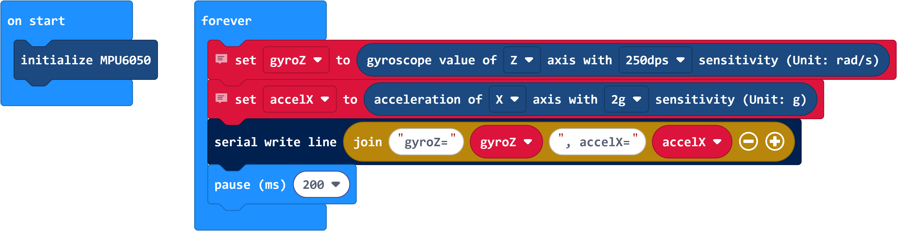
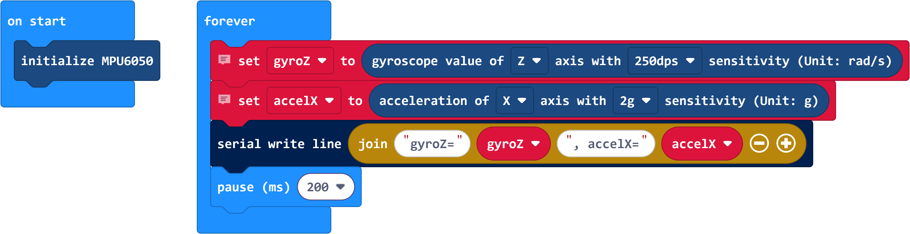
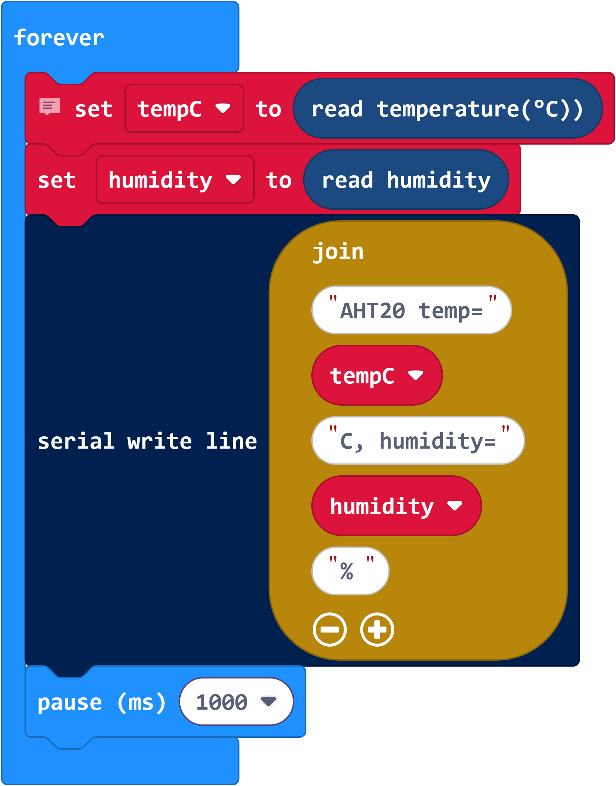
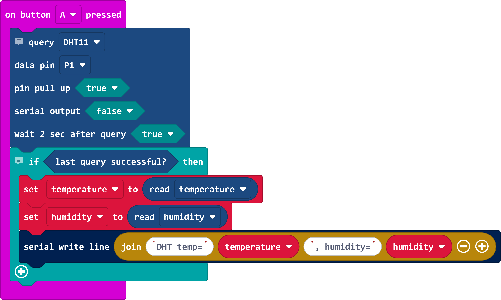
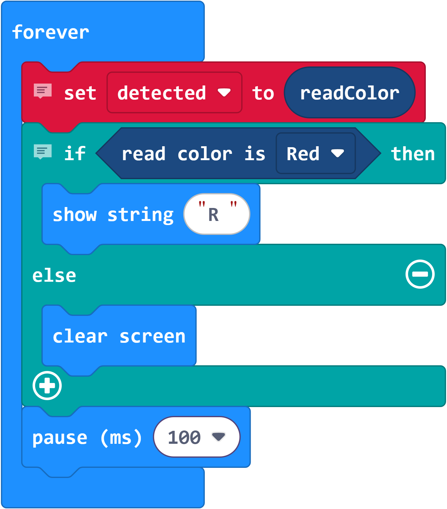

# pxt-pks-shield-v2

Peanut King micro:bit Shield V2 extension for motors, servos, sensors, and I2C modules.

## Product URL

Product URL: https://www.peanutkingsolution.com/en/product-page/peanut-king-micro-bit-shield-v2-%E6%93%B4%E5%B1%95%E6%9D%BF

## Summary

This extension exposes the main features of the Peanut King Shield V2 to MakeCode for micro:bit.
It includes APIs for:

- DC motor control
- Servo control
- Light and fan outputs
- MPU6050 gyroscope and acceleration readings
- Ultrasonic, compound eye, and color sensors
- AHT20 and DHT temperature and humidity sensors
- DS1302 real-time clock support
- I2C channel switching for the different shield configurations

```package
pksdriver=github:peanut-king-solution/pxt-pks-shield-v2
```

## Example: Drive Two Motors

Use `motorRun` to drive each motor independently, then stop everything with `motorStopAll`.


```blocks
basic.forever(function () {
    // Drive M1 and M2 forward at moderate speed.
    pksdriver.motorRun(pksdriver.PKSDriverMotors.M1, pksdriver.PKSDriverDir.CW, 80)
    pksdriver.motorRun(pksdriver.PKSDriverMotors.M2, pksdriver.PKSDriverDir.CW, 80)
    basic.pause(1500)

    // Reverse both motors to back away.
    pksdriver.motorRun(pksdriver.PKSDriverMotors.M1, pksdriver.PKSDriverDir.CCW, 80)
    pksdriver.motorRun(pksdriver.PKSDriverMotors.M2, pksdriver.PKSDriverDir.CCW, 80)
    basic.pause(1500)

    // Stop all motor outputs before the next cycle.
    pksdriver.motorStopAll()
    basic.pause(500)
})
```

## Example: Position a Servo

Use `servo` to move a connected servo to a target angle.

```blocks
input.onButtonPressed(Button.A, function () {
    // Move servo S1 to 0 degrees.
    pksdriver.servo(pksdriver.PKSDriverServos.S1, 0)
})

input.onButtonPressed(Button.B, function () {
    // Move servo S1 to 180 degrees.
    pksdriver.servo(pksdriver.PKSDriverServos.S1, 180)
})

input.onButtonPressed(Button.AB, function () {
    // Turn the servo output off when it is no longer needed.
    pksdriver.servoOff(pksdriver.PKSDriverServos.S1)
})
```

## Example: Read the MPU6050

Initialize the MPU6050 once, then read gyroscope and acceleration values inside a loop.



```typescript
pksdriver.initMPU6050()

basic.forever(function () {
    // Read yaw rate on the Z axis in radians per second.
    let gyroZ = pksdriver.gyroscope(axisXYZ.z, gyroSen.range_250_dps)

    // Read acceleration on the X axis in g.
    let accelX = pksdriver.axisAcceleration(axisXYZ.x, accelSen.range_2_g)

    serial.writeLine("gyroZ=" + gyroZ + ", accelX=" + accelX)
    basic.pause(200)
})
```

## Example: Read Temperature and Humidity

The shield supports both AHT20 and DHT sensors. Use the API that matches the sensor you connected.



```typescript
basic.forever(function () {
    // Read the AHT20 sensor over I2C.
    let tempC = pksdriver.aht20ReadTemperatureC()
    let humidity = pksdriver.aht20ReadHumidity()

    serial.writeLine("AHT20 temp=" + tempC + "C, humidity=" + humidity + "%")
    basic.pause(1000)
})
```



```typescript
input.onButtonPressed(Button.A, function () {
    // Query a DHT11 or DHT22 sensor connected to pin P1.
    pksdriver.queryData(DHTtype.DHT11, DigitalPin.P1, true, false, true)

    // Only read values after a successful query.
    if (pksdriver.readDataSuccessful()) {
        let temperature = pksdriver.readData(dataType.temperature)
        let humidity = pksdriver.readData(dataType.humidity)
        serial.writeLine("DHT temp=" + temperature + ", humidity=" + humidity)
    }
})
```

## Example: Use the Color Sensor

Use the color sensor helpers to inspect raw channels or compare the detected color directly.



```typescript
basic.forever(function () {
    // Read the detected color enum from the sensor.
    let detected = pksdriver.readColor()

    // React when red is detected.
    if (pksdriver.checkReadColor(pksdriver.PKSDriverColor_t.Red)) {
        basic.showString("R")
    } else {
        basic.clearScreen()
    }

    basic.pause(100)
})
```

## Example: Create and Read the RTC

Create the DS1302 instance once, then use the helper blocks exposed by this package.



```typescript
let rtc = pksdriver.create(DigitalPin.P13, DigitalPin.P14, DigitalPin.P15)

// Set the RTC to 2026-05-11 Tuesday 08:30:00.
pksdriver.DateTime(2026, 5, 11, 2, 8, 30, 0)

basic.forever(function () {
    let hour = pksdriver.getHour()
    let minute = pksdriver.getMinute()
    let second = pksdriver.getSecond()

    serial.writeLine("time=" + hour + ":" + minute + ":" + second)
    basic.pause(1000)
})
```

## Notes

- The AHT20 support is implemented directly in this extension so it does not rely on the unapproved upstream AHT20 package.
- Other APIs still wrap functionality provided by dependencies such as `DS1302`, `SEN-MPU6050`, and `pxt-DHT11_DHT22`.

## License
This project is licensed under the **MIT License**.

This software incorporates portions of several third-party libraries. In accordance with the MIT License, the original copyright notices and permissions for these dependencies are acknowledged:
- **AHT20**: [koudayao27/AHT20](https://github.com/koudayao27/AHT20)
- **pxt-DHT11_DHT22**: [alankrantas/pxt-dht11_dht22](https://github.com/alankrantas/pxt-dht11_dht22)
- **SEN-MPU6050**: [joy-it/sen-mpu6050](https://github.com/joy-it/sen-mpu6050)
- **DS1302**: [makecode-extensions/ds1302](https://github.com/makecode-extensions/ds1302)

## Supported targets
- for PXT/microbit
